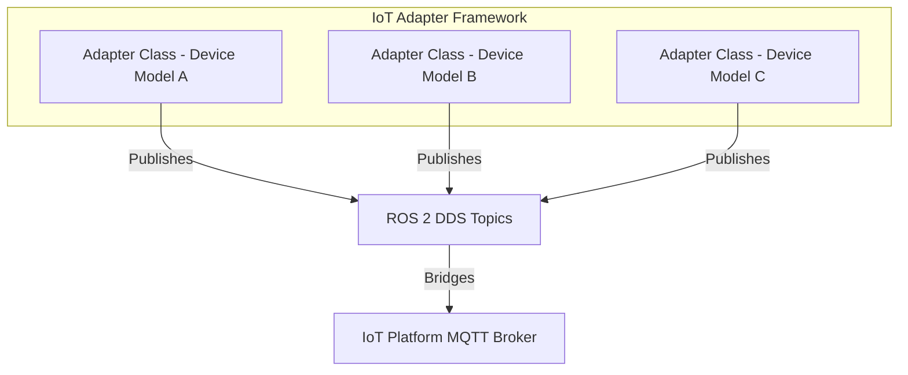

# 🏗️ Architecture Design Decisions

## Goal

This document records **key architecture design decisions** for the ROS 2 IoT Adapter project to ensure alignment, maintainability, and technical clarity across development and deployment teams.

---

## High-Level Design Choices

### 1. **Framework: ROS 2 Jazzy**

✅ **Selected** for mature real-time messaging, DDS support, and active LTS community.

🔍 **Alternatives considered:**

* MQTT-native Python adapters with custom concurrency – rejected due to lack of built-in device namespace management and real-time capabilities.
* ROS 1 Noetic – rejected due to end-of-life support.

### 2. **Language: Python (asyncio)**

✅ **Selected** for rapid development, ROS 2 Python API support, and ease of async client implementation.

🔍 **Alternatives considered:**

* C++ – high performance but longer development time and lower adapter agility.

### 3. **Adapter Class Design Per Device Model**

✅ **Selected** to enforce single responsibility and encapsulation, simplifying maintenance and multi-device scalability.

🔍 **Alternatives considered:**

* Generic adapter with device-specific config parsing – rejected due to complex conditional flows and reduced clarity.

### 4. **Dockerised Deployment**

✅ **Selected** for portability, reproducibility, and consistent environment replication on Raspberry Pi.

🔍 **Alternatives considered:**

* Bare-metal ROS 2 installation – rejected due to dependency conflicts, manual management complexity, and lack of environment isolation.

### 5. **CI/CD with GitHub Actions and Self-hosted Runner**

✅ **Selected** to integrate with existing organisational workflows, enable PR-based CI validation, and automate deployment on Raspberry Pi.

🔍 **Alternatives considered:**

* External CI tools (Jenkins, GitLab CI) – rejected for this project due to overhead of self-hosted management when GitHub Actions was natively available.

---

## Detailed Design Decisions

### Async Client Design

* **Design:** All device clients are implemented as asyncio-based classes with isolated event loops per ROS 2 node.
* **Justification:** Ensures non-blocking communication with multiple devices concurrently without multi-threading overhead.

### ROS 2 Node-per-Instance Pattern

* **Design:** Each device adapter runs as an independent ROS 2 node.
* **Justification:** Provides clear namespace segregation, logging isolation, and decoupled lifecycle management.

### Secure Deployment

* **Design:** Container images use minimal base layers, no root process, and environment variables are injected securely via GitHub Actions secrets.
* **Justification:** Aligns with container security best practices for production deployments.

---

## Diagrams

---

## TODO Checklist

* [ ] Finalise QoS profiles per device topic
* [ ] Evaluate DDS security plugin support for deployment
* [ ] Review adapter abstract base class design for future extensibility
* [ ] Document resource usage benchmarks per adapter type

---

## Troubleshooting

| Issue                          | Possible Cause                       | Resolution                                            |
| ------------------------------ | ------------------------------------ | ----------------------------------------------------- |
| High CPU usage in adapter node | Blocking calls in asyncio coroutines | Refactor to async-native I/O methods                  |
| Device communication delays    | QoS mismatch or DDS misconfiguration | Review QoS profiles and ROS 2 network setup           |
| Docker image size large        | Unoptimised base image               | Rebuild using ROS 2 slim images and multi-stage build |

---

## Summary

This document captures the **architecture design decisions** for the ROS 2 IoT Adapter project, ensuring a clear, scalable, and secure implementation approach aligned with organisational standards.

➡️ **Next:** Refer to [deployment\_playbook.md](deployment_playbook.md) for environment setup and deployment execution guidelines.

---
